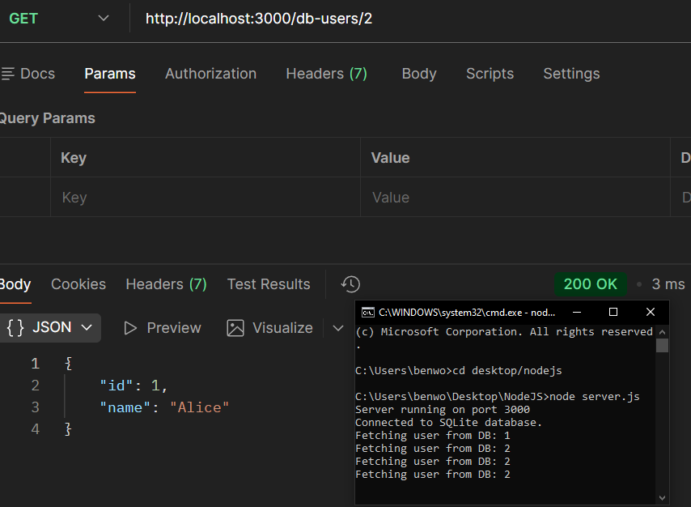

# Case: 200 OK (Incorrect Data Returned)

**Issue**  
User reports that the API returns incorrect user data when requesting specific users.

---

## Reproduction

Send GET requests to:

GET http://localhost:3000/db-users/1  
GET http://localhost:3000/db-users/2  

---

## Observed Behavior

API returns 200 OK for both requests, but returns the same user data regardless of the requested user ID.

Example:
- `/db-users/1` → Alice  
- `/db-users/2` → Alice  

---

## Expected Behavior

API should return the correct user data corresponding to the requested user ID.

---

## Log Output

```
Fetching user from DB: 1
Fetching user from DB: 2
```

---

## Analysis

The request is valid and reaches the correct endpoint. Logs confirm that the correct user ID is received by the server. Since the response always returns the same data, the issue occurs during database query execution rather than request handling, authentication, or routing.

---

## Root Cause

The database query is hardcoded (`WHERE id = 1`) and does not use the request parameter. As a result, the same user record is returned for all requests.

---

## Resolution

Update the query to use the request parameter:
```
SELECT * FROM users WHERE id = ?
```
and pass the user ID as a parameter.

---

## Example Response


