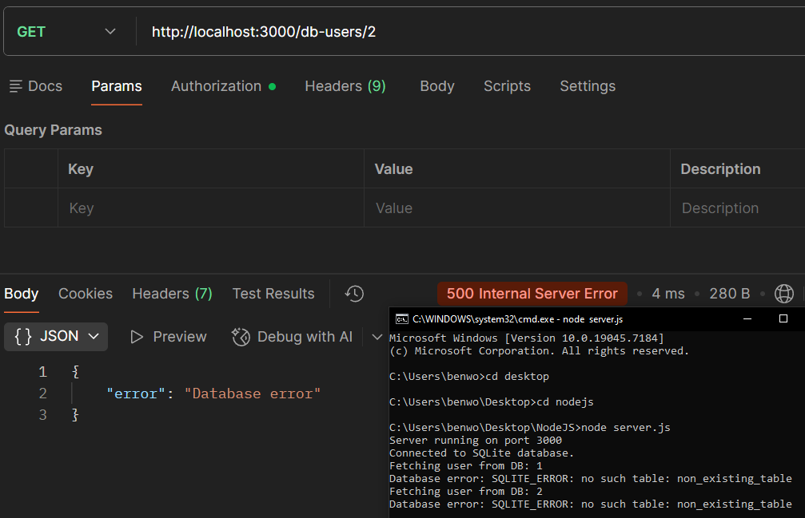

# Case: 500 Internal Server Error (Database Table Missing)

**Issue**  
User receives a 500 Internal Server Error when attempting to retrieve a user.

---

## Reproduction

Send a GET request to:

GET http://localhost:3000/db-users/1

---

## Observed Behavior

API returns 500 Internal Server Error.

---

## Expected Behavior

API should return user data for a valid user ID.

---

## Log Output
```
SQLITE_ERROR: no such table: non_existing_table
```
---

## Analysis

The request is valid and reaches the correct endpoint. The error occurs during server-side processing when the API attempts to query the database. The log output indicates the failure originates from the database layer rather than request validation, authentication, or routing.

---

## Root Cause

The database query references a table (`non_existing_table`) that does not exist, causing the query to fail.

---

## Resolution

Update the query to reference the correct table (`users`) or ensure the database schema is properly initialized before handling requests.

---

## Example Response


