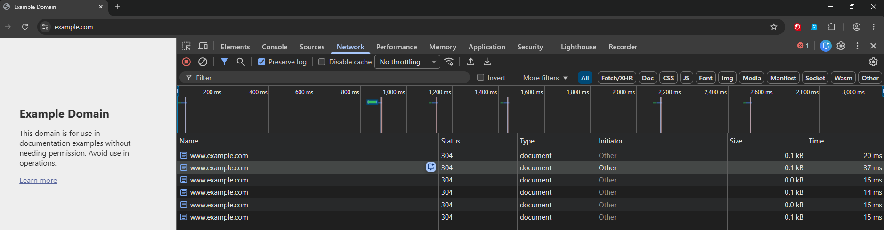
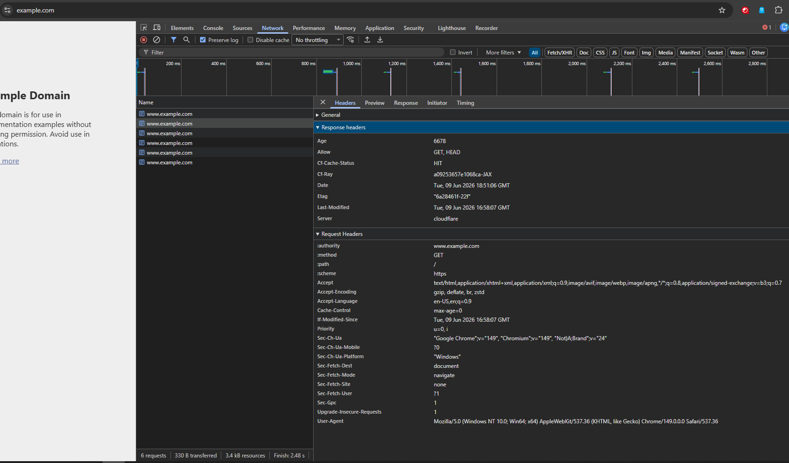

# Browser Investigation: HTTP 304 Not Modified

## Overview

This investigation examines an **HTTP 304 Not Modified** response captured in Chrome DevTools while accessing `https://www.example.com/`.

The objective is to understand why the browser receives a **304 Not Modified** response instead of **200 OK** and document the investigation process using browser network data and HTTP headers.

---

## Issue

A page refresh returns **304 Not Modified** instead of **200 OK**, leading to questions about whether the browser is displaying stale content or whether the server is functioning correctly.

---

## Environment

| Property | Value |
|------------|------------|
| Browser | Google Chrome |
| Tool | Chrome DevTools - Network Tab |
| Request Method | GET |
| URL | https://www.example.com/ |

---

## Reproduction

1. Open Chrome DevTools.
2. Navigate to the **Network** tab.
3. Enable **Preserve log**.
4. Leave **Disable cache** unchecked.
5. Refresh the page multiple times.
6. Select the request returning **304 Not Modified**.

---

## Observed Behavior

The browser sends a **GET** request and receives:

```
Status Code: 304 Not Modified
```

Unlike a **200 OK** response, the server does not transmit the HTML response body again. Instead, the browser reuses the cached copy that it already stored locally.

---

## Expected Behavior

If the requested resource has changed, the server should return:

```
200 OK
```

along with an updated response body.

If the resource has not changed, the server may return:

```
304 Not Modified
```

allowing the browser to reuse its cached copy instead of downloading the resource again.

---

## Evidence Collected

### General

| Property | Value |
|------------|------------|
| Request URL | https://www.example.com/ |
| Request Method | GET |
| Status Code | 304 Not Modified |

### Request Headers

| Header | Value |
|------------|------------|
| Cache-Control | max-age=0 |
| If-Modified-Since | Tue, 09 Jun 2026 16:58:07 GMT |

### Response Headers

| Header | Value |
|------------|------------|
| ETag | "6a28461f-22f" |
| Last-Modified | Tue, 09 Jun 2026 16:58:07 GMT |

---

## Why These Headers Matter

| Header | Purpose |
|------------|------------|
| **If-Modified-Since** | Tells the server when the browser last received the resource. |
| **Last-Modified** | Indicates when the server last updated the resource, allowing it to compare timestamps. |
| **ETag** | Acts as a version identifier for the resource and provides another method of cache validation. |
| **Cache-Control: max-age=0** | Instructs the browser to validate its cached copy with the server before reusing it. |

---

## Analysis

The browser already has a cached copy of the page and includes an **If-Modified-Since** header when making the request.

The server compares this value with its **Last-Modified** timestamp and determines that the resource has not changed.

Rather than transmitting the HTML document again, the server returns **304 Not Modified**, allowing the browser to reuse its existing cached copy.

The presence of both **Last-Modified** and **ETag** provides cache validation mechanisms that help avoid unnecessary data transfers while ensuring the browser displays the current version of the resource.

---

## Root Cause

No application or server error was identified.

The browser and server successfully performed HTTP cache validation, resulting in an expected **304 Not Modified** response.

---

## Resolution

No corrective action is required.

The observed behavior indicates that browser caching is functioning correctly.

If updated content is required, performing a hard refresh or clearing the browser cache will force retrieval of a new copy of the resource.

---

## Support Engineer Skills Demonstrated

- Chrome DevTools
- Browser Network Analysis
- HTTP Request and Response Inspection
- Header Analysis
- Browser Cache Investigation
- Root Cause Analysis
- Technical Documentation

---

## Screenshots

### Network Request



### Request and Response Headers


