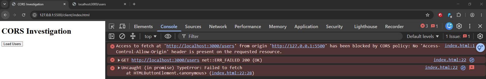
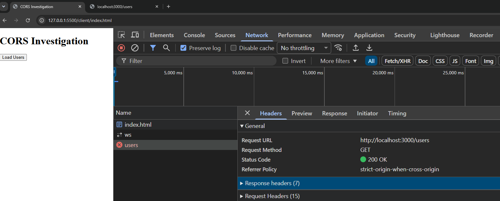
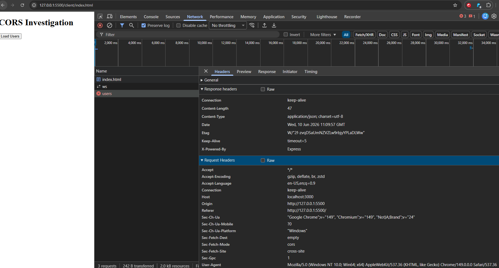
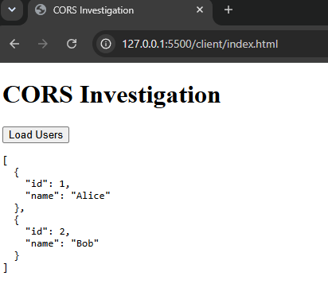
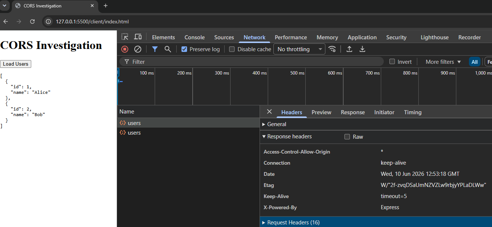

# Browser Investigation: CORS Policy Blocking API Request

## Overview

This investigation examines a browser request that fails despite the API returning **200 OK**.

The objective is to identify why the frontend cannot access the API response, determine the root cause using Chrome DevTools, and verify the resolution after enabling CORS support.

---

## Issue

Clicking **Load Users** does not display any data even though the API endpoint returns valid JSON and responds with 200 OK.

---

## Environment

| Property | Value |
|------------|------------|
| Browser | Google Chrome |
| Tool | Chrome DevTools |
| Frontend | Live Server (`http://127.0.0.1:5500`) |
| Backend | Express API (`http://localhost:3000`) |
| Request Method | GET |

---

## Reproduction

1. Start the Express API.
2. Open the frontend using Live Server.
3. Open Chrome DevTools.
4. Click **Load Users**.

---

## Observed Behavior

- No user data is displayed.
- The Browser Console reports a CORS policy error.
- The Network tab shows a successful **GET** request with **200 OK**.
- Access to the response is blocked by the browser.

---

## Evidence Collected

### Browser Console

```
Access to fetch at 'http://localhost:3000/users'
from origin 'http://127.0.0.1:5500' has been blocked by CORS policy:

No 'Access-Control-Allow-Origin' header is present on the requested resource.
```

### Network Request

| Property | Value |
|------------|------------|
| Request | GET /users |
| Status | 200 OK |
| Type | fetch |

### Response Headers (Before Fix)

| Header | Value |
|------------|------------|
| Access-Control-Allow-Origin | Not present |

---

## Analysis

The API successfully returns 200 OK, but the browser prevents JavaScript from accessing the response because the required CORS header is missing.

However, the frontend and API are running from different origins:

- Frontend: `http://127.0.0.1:5500`
- Backend: `http://localhost:3000`

Because the response does not include an **Access-Control-Allow-Origin** header, the browser enforces its Same-Origin Policy and prevents JavaScript from accessing the response.

The issue is caused by browser security rather than an API or network failure.

---

## Root Cause

The Express API does not include the required **Access-Control-Allow-Origin** response header.

As a result, the browser blocks frontend access to an otherwise successful API response.

---

## Resolution

Install the Express cors middleware and enable it using app.use(cors()) so the API includes the required Access-Control-Allow-Origin response header.

```javascript
const cors = require("cors");

app.use(cors());
```

This adds the required response headers, allowing the browser to access the API response.

---

## Verification

After enabling CORS middleware:

- The Browser Console no longer reports a CORS policy error.
- The response includes an `Access-Control-Allow-Origin` header.
- The frontend successfully displays the returned JSON data.
- The API continues to return `200 OK`.
- Browser JavaScript can successfully access the API response.

---

## Why This Investigation Matters

This investigation demonstrates that a successful HTTP response does not always mean a frontend application can access the returned data.

Browser security policies may block JavaScript from reading an otherwise successful API response when required CORS headers are missing.

Understanding this distinction helps narrow troubleshooting efforts and avoid incorrectly identifying a healthy API as the source of the issue.

---

## Support Engineer Skills Demonstrated

- Chrome DevTools
- Browser Console Analysis
- Network Request Investigation
- HTTP Header Analysis
- CORS Troubleshooting
- Express Middleware Configuration
- Root Cause Analysis
- Technical Documentation

---

## Screenshots

### Before Fix

#### Browser Console Error



#### Network Request



#### Response Headers (Before Fix)



### After Fix

#### Successful Browser Response



#### Response Headers (After Fix)


