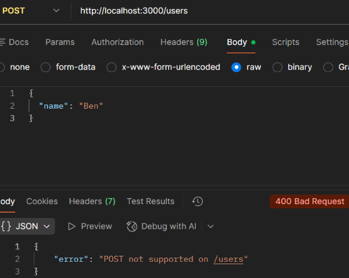

## Case: 400 Bad Request (Unsupported HTTP Method)

**Issue**  
User receives a 400 Bad Request when attempting to create a user.

**Reproduction**  
Send a POST request to `/users`:

POST http://localhost:3000/users

**Observed Behavior**  
API returns a 400 Bad Request indicating the operation is not supported.

**Expected Behavior**  
API should either support user creation or provide a clearly defined endpoint for POST requests.

**Analysis**  
The request reaches the correct endpoint, but the HTTP method does not match what the route supports. This indicates a mismatch between the request method and the server’s expected behavior for that endpoint.

**Root Cause**  
The `/users` endpoint does not support POST requests. It is configured to handle GET requests only, so using POST results in a 400 response.

**Resolution**  
Use the correct HTTP method and endpoint combination. In this case, `/users` should be accessed using GET for retrieving users.

**Example Response:**  

