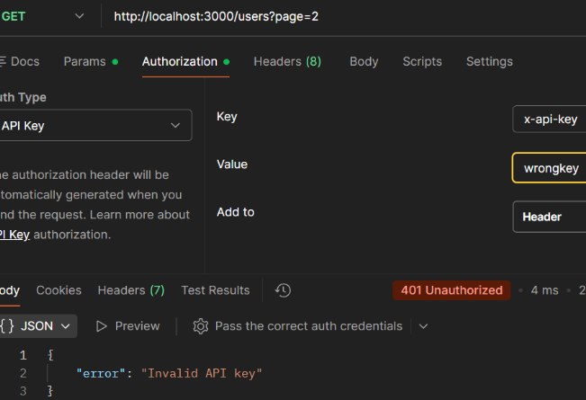

## Case: 401 Unauthorized (Invalid API Key)

**Issue**  
User receives a 401 Unauthorized error when attempting to retrieve users, despite including an API key.

**Reproduction**  
Send a GET request to `/users?page=2` with an incorrect API key:

GET http://localhost:3000/users?page=2  
Header: x-api-key: wrongkey

**Observed Behavior**  
API returns 401 Unauthorized indicating the API key is invalid.

**Expected Behavior**  
API should return user data when a valid API key is provided.

**Analysis**  
The request reaches the endpoint with the required authentication header present, but the credentials fail verification. This indicates the failure occurs during the authentication stage rather than due to missing credentials or request validation.

**Root Cause**  
The request includes an API key, but the value is incorrect. The authentication check fails because the provided key does not match the expected value.

**Resolution**  
Ensure the correct API key is included in the request header (e.g., `x-api-key: secret123`).

**Example Response:**  

