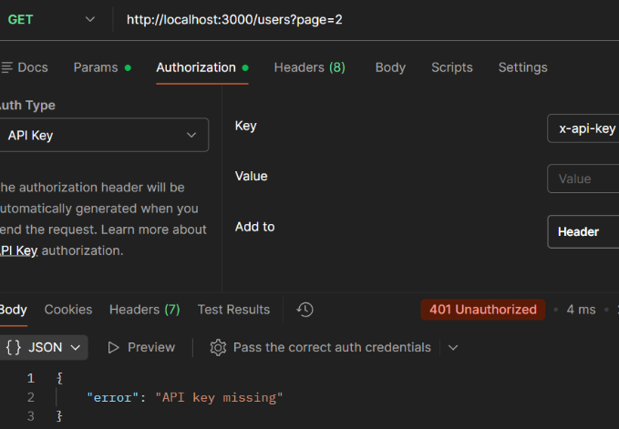

## Case: 401 Unauthorized (Missing API Key)

**Issue**  
User receives a 401 Unauthorized error when attempting to retrieve users.

**Reproduction**  
Send a GET request to `/users?page=2` without including an API key:

GET http://localhost:3000/users?page=2

**Observed Behavior**  
API returns 401 Unauthorized indicating the API key is missing.

**Expected Behavior**  
API should return user data when a valid request is made with proper authentication.

**Analysis**  
The request is sent to a valid endpoint with correct parameters, but fails before processing due to missing authentication credentials. This indicates the failure occurs at the authentication stage.

**Root Cause**  
The request does not include the required `x-api-key` header, causing authentication to fail before the request is processed.

**Resolution**  
Include a valid `x-api-key` header in the request (e.g., `x-api-key: secret123`).

**Example Response:**  

