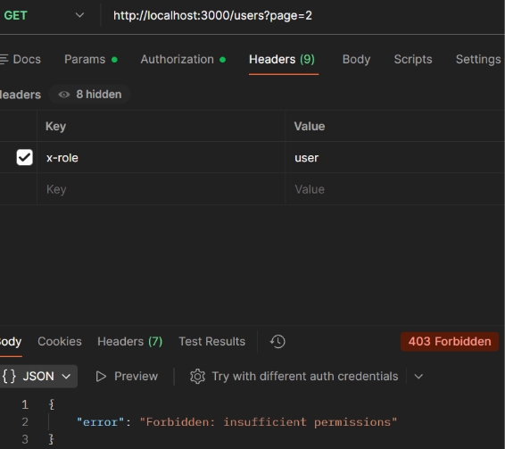

## Case: 403 Forbidden (Insufficient Permissions)

**Issue**  
User receives a 403 Forbidden error when attempting to retrieve users.

**Reproduction**  
Send a GET request to `/users?page=2` with valid authentication but insufficient permissions:

GET http://localhost:3000/users?page=2  
Header: x-api-key: secret123  
Header: x-role: user

**Observed Behavior**  
API returns 403 Forbidden indicating insufficient permissions.

**Expected Behavior**  
API should return user data when the request is both authenticated and authorized.

**Analysis**  
The request includes valid authentication credentials and reaches the endpoint successfully, but access is denied due to insufficient permissions. This indicates the failure occurs at the authorization stage after authentication has succeeded.

**Root Cause**  
The request is successfully authenticated using the `x-api-key`, but the user does not have the required permissions (`admin` role) to access the endpoint.

**Resolution**  
Ensure the request includes appropriate permissions or role (e.g., `x-role: admin`) when accessing restricted endpoints.

**Example Response:**  

