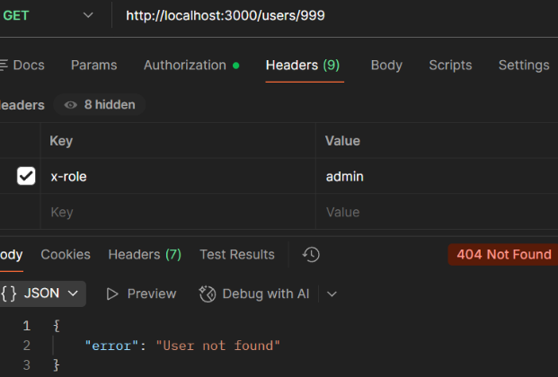

## Case: 404 Not Found (Resource Does Not Exist)

**Issue**  
User receives a 404 Not Found error when attempting to retrieve a specific user.

**Reproduction**  
Send a GET request to `/users/999` with valid authentication:

GET http://localhost:3000/users/999  
Header: x-api-key: secret123  
Header: x-role: admin

**Observed Behavior**  
API returns 404 Not Found indicating the user does not exist.

**Expected Behavior**  
API should return user data when a valid user ID is provided.

**Analysis**  
The request is sent to a valid endpoint with proper authentication, but the requested resource does not exist. This indicates the failure occurs at the resource lookup stage rather than routing or authentication.

**Root Cause**  
The request targets a valid endpoint, but the specified user ID does not exist in the system.

**Resolution**  
Ensure that the requested resource exists by verifying the user ID before making the request.

**Example Response:**  

