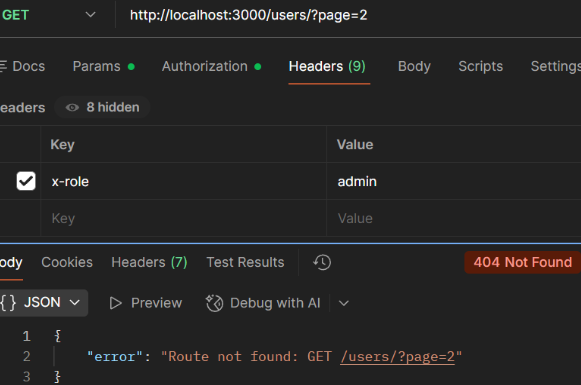

## Case: 404 Not Found (Route Mismatch – Trailing Slash)

**Issue**  
User receives a 404 Not Found error when attempting to retrieve users, despite using what appears to be the correct endpoint.

**Reproduction**  
Send a GET request to `/users/?page=2`:

GET http://localhost:3000/users/?page=2

**Observed Behavior**  
API returns 404 Not Found indicating the route does not exist.

**Expected Behavior**  
API should return user data when the correct endpoint is used.

**Analysis**  
The request is sent to a valid server, but the route does not match exactly due to a trailing slash. With strict routing enabled, `/users` and `/users/` are treated as different endpoints, causing the request to fail at the routing stage.

**Root Cause**  
The request includes a trailing slash (`/users/`), which does not match the defined route (`/users`). The server treats these as separate endpoints and returns a 404.

**Resolution**  
Ensure the request URL exactly matches the defined route. Use `/users` instead of `/users/`.

**Example Response:**  

