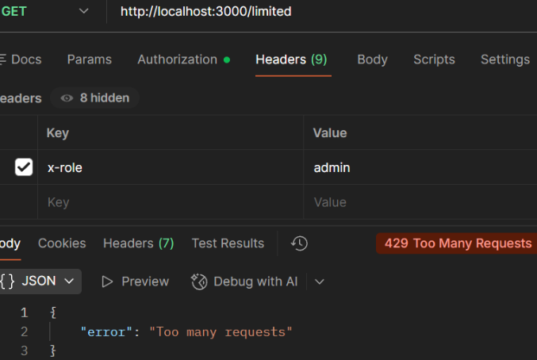

## Case: 429 Too Many Requests (Rate Limiting)

**Issue**  
User receives a 429 Too Many Requests error when making repeated API calls.

**Reproduction**  
Send repeated GET requests to `/limited`:

GET http://localhost:3000/limited

**Observed Behavior**  
API initially returns 200 OK, but after exceeding a threshold, returns 429 Too Many Requests.

**Expected Behavior**  
API should allow requests within defined limits and reject excessive requests.

**Analysis**  
The request is valid and the endpoint functions correctly, but the system enforces a request threshold. The failure occurs due to rate limiting, indicating a system protection mechanism rather than a client or server error.

**Root Cause**  
The API enforces rate limiting to prevent excessive usage. Once the request threshold is exceeded, additional requests are temporarily blocked.

**Resolution**  
Reduce request frequency or implement retry logic with delays. If needed, request higher rate limits from the service.

**Example Response:**  

