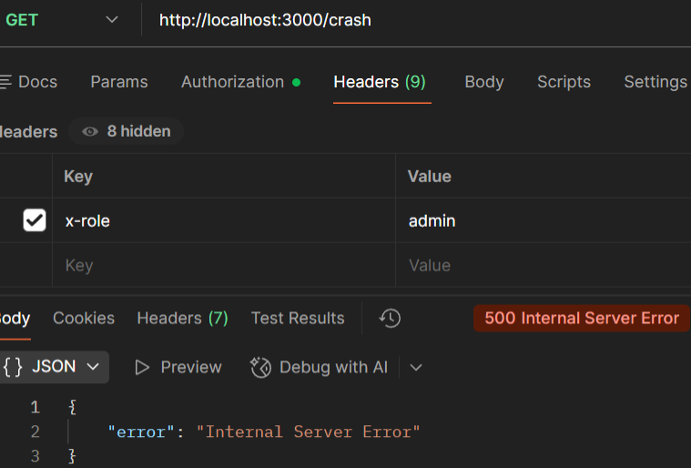

## Case: 500 Internal Server Error (Server Crash)

**Issue**  
User receives a 500 Internal Server Error when accessing the endpoint.

**Reproduction**  
Send a GET request to `/crash`:
GET http://localhost:3000/crash

**Observed Behavior**  
API returns 500 Internal Server Error.

**Expected Behavior**  
API should process the request successfully and return a valid response.

**Analysis**  
The request is valid, and the failure occurs during server-side execution, indicating a backend processing error.

**Root Cause**  
A runtime error occurs during request processing due to an undefined variable, causing the server to fail.

**Resolution**  
Fix the server-side code by ensuring all variables are properly defined and handled before use.

**Example Response:**  

